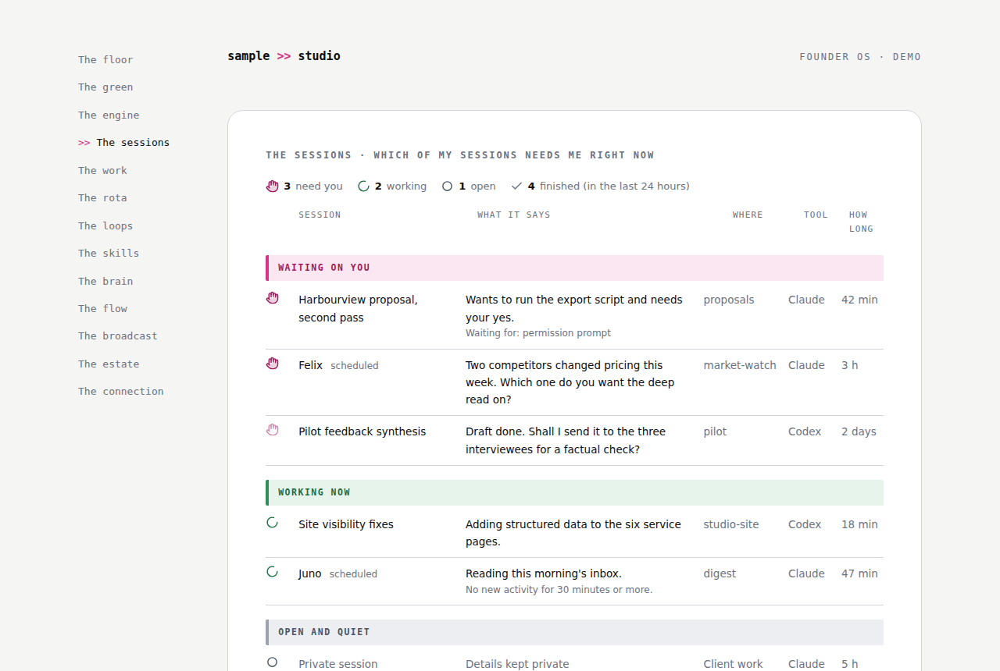

# Founder OS

A calm command centre for a founder who works with more than one AI tool.

If you've ever run a business with people in it, you'll remember what a good office gave you. You could look up and see who was working on what. You could hand a job to someone and trust it would come back done, with a note. You could feel the state of things without asking. And if you're building your first business right now, on your own, with AI tools where the employees would be, that feeling is exactly what's missing: the work happens, but you can't see it, and you've quietly become the person carrying every task between the tools.

Founder OS puts the office back. It's a small set of pages that sits on your own machine and treats your AI setup the way you'd treat a workplace: your tools become buildings on a campus, your agents become colleagues with names and desks, and the day-to-day starts to feel like somewhere you can orientate yourself each morning rather than a stack of chat windows. Thirteen rooms, each answering exactly one question, all of it running on data that is allowed to say "I don't know".

This repo is the vanilla version: the pattern, with the builder's private data removed, so you can make your own.

If you'd rather walk through the story first, the [workshop site](https://founder-os-workshop.vercel.app) tells it room by room, with screenshots, at your own pace.

## The campus

The whole thing runs on one analogy, and it's worth having before anything else.

Your AI tools are **buildings on a campus**, each with its own faculty: one is better at reasoning and writing, one at code, one at research. You don't crown a favourite; you use each building for what it teaches best. Tools you own but haven't put to work are empty lots, honestly labelled.

Your agents are **colleagues, not buildings**. A colleague clocks in at a building, but nothing that makes them who they are lives there. Name them like people: "Nell hasn't run since Monday" lands differently from "cron job 4 failed", and the difference is what makes you actually look.

A **keycard** is a connection plus a permission, and some doors (send, publish, spend) open only with your signature at the **gatehouse**. Your memory is the **library** and your procedures are the **workshop**: two pillars every building connects to, so nothing stays trapped where it was made.

And at the centre of the campus is the **green**: the open space where you're not in any building at all: family, sport, learning, rest. It's on the map because a founder OS that can't see your Wednesday evening will schedule over it forever.

The whole analogy also exists as a single machine-readable file, [campus.yaml](campus.yaml): the map pinned up at the entrance, so your agent reads the same structure you do instead of guessing it from prose.

## What it looks like

Four of the rooms, with demo data for a fictional studio. The pages themselves are in [demo/](demo/): download the repo and open them in any browser, nothing to install.

**The floor**: did my agents show up today? The next move at the top, one line from the chief of staff, and every agent at a named desk with an honest last-ran read.

**The green**: the week as a human week. Work blocks, life markers, protected time drawn as first-class blocks, and the charter: the rules the system obeys about its human.

**The engine**: what waits on a human, what's in motion, and receipts for what the agents proved. It points at the real task board; it never duplicates it.

**The sessions**: which of my AI sessions needs me right now? One row per open session across tools, a raised hand on anything stuck at a prompt or a question, and a label only for anything on the privacy list.

## The rooms at a glance

| Room | The one question it answers |
|---|---|
| [The floor](rooms/01-the-floor.md) | Did my agents show up today? |
| [The green](rooms/02-the-green.md) | What does my week look like as a human, not a machine? |
| [The engine](rooms/03-the-engine.md) | What work is moving, and what waits on me? |
| [The sessions](rooms/12-the-sessions.md) | Which of my AI sessions needs me right now? |
| [The work](rooms/04-the-work.md) | Where do I sit down and do the job? |
| [The rota](rooms/05-the-rota.md) | When does everything run, and on whose meter? |
| [The loops](rooms/13-the-loops.md) | What keeps running without me, and where is my hand on it? |
| [The skills](rooms/06-the-skills.md) | How is work done here, and is it owned or rented? |
| [The brain](rooms/07-the-brain.md) | What does my system remember, and is it healthy? |
| [The flow](rooms/08-the-flow.md) | How does data move through my whole stack? |
| [The broadcast](rooms/09-the-broadcast.md) | What am I saying to the world, and on which frequency? |
| [The estate](rooms/10-the-estate.md) | Are my public websites in good order, for people and for agents? |
| [The connection](rooms/11-the-connection.md) | What does all of this mean, and what's worth writing about? |

Read them in that order and you'll walk my daily loop first (floor, green, engine, sessions, work), then the reference rooms, then the outward-facing ones. The connection comes last on purpose: it's the room that joins the dots.

## What has grown since

The starter was cut in July and my own version has kept moving. Two rooms have earned their way in here since, and one has changed shape.

The sessions came out of a lost day. I'd left a scheduled run in flight and found it the next afternoon still sitting at a permission prompt, waiting for a yes I didn't know it needed. The best part of a day and a half of nothing. The floor couldn't see it, because the floor only knows whether an agent showed up, not whether it got stuck halfway through. So the sessions room reads the Claude desktop app's own session files on the Mac, with no model calls, and lists every open session with a raised hand on the ones that need me. It's the first room in this repo that ships with working code rather than a pattern: a compiler, a page, an example privacy list and a launchd job, all in [tools/sessions/](tools/sessions/). It won't run at all without the privacy list, which is the only way I've found to be sure nothing private lands on a page by accident.

The loops are the opposite kind of room: no code, just a register. Once three or four jobs were running on their own, drafting, illustrating, sending me a preview, I kept having to open the scheduler to remember what each one did and where my hand was on it. Now it's written down in plain words, one loop at a time, with the human gate as the last step every time. If I want to change one, I say its name.

And the green has become the week. It still protects the human; it now also shows the real calendar beside the cards in flight, on one page, because I kept looking at both and doing the join in my head. The rule held: it shows the shape of the week, it never becomes a to-do list. The note is in [the green's room file](rooms/02-the-green.md).

There's a verifier room too, where a second model is told to refute the first one's work before I look at it. I've left it out of here. It needs a task board, two model families and a build pipeline, and nobody needs that in their first month.

## The rules underneath

Every room obeys the same [honesty rules](principles/honesty-rules.md), and they're the actual product. The short version: never fabricate a signal, label every placeholder, one timestamp one truth, silence beats filler, and busyness is not progress. My first version of this dashboard died because it broke those rules. This one has held because it can't.

## Where it came from

Built in the open in Cornwall, mostly by talking to an agent over a couple of days, standing on the shoulders of people who shared their working generously. The concepts this borrows and what was changed are credited properly in [principles/credits.md](principles/credits.md): Nate B. Jones's Open Brain, Open Skills, and Open Engine; Ankit Patel's architecture thinking; and the Exec Circle community around them. Mark Bunce and ashton-papi gave it the manifest and the confidence words within a day of it going public. The sessions room started with Limited Edition Jonathan, from Nate's WhatsApp group, and the session board plugin he was building; I borrowed the idea rather than the tool. The campus metaphor, the honesty rules, and the green are the parts I'd claim as mine.

## Feeding back

This repo exists because people shared their working, so the same applies here. If something is unclear, wrong, or missing, open an issue and say so plainly; blunt is welcome. If you build your own corner, I'd genuinely like to see it, and with your permission I'll link a small gallery of other people's versions here so the map keeps travelling. wendy@fourteenseed.com

## Changes

- **5 October 2026.** The sessions and the loops rooms, with the sessions shipping as working code, and a note on how the green became the week.
- **4 July 2026.** The contract layer: the campus manifest, the six confidence words and the proof gates, from Mark Bunce's and ashton-papi's feedback.
- **3 July 2026.** First public version: eleven rooms, the campus, the honesty rules, and demo pages for the fictional studio.

Wendy Harris, Fourteen Seed
Cornwall >> internet
