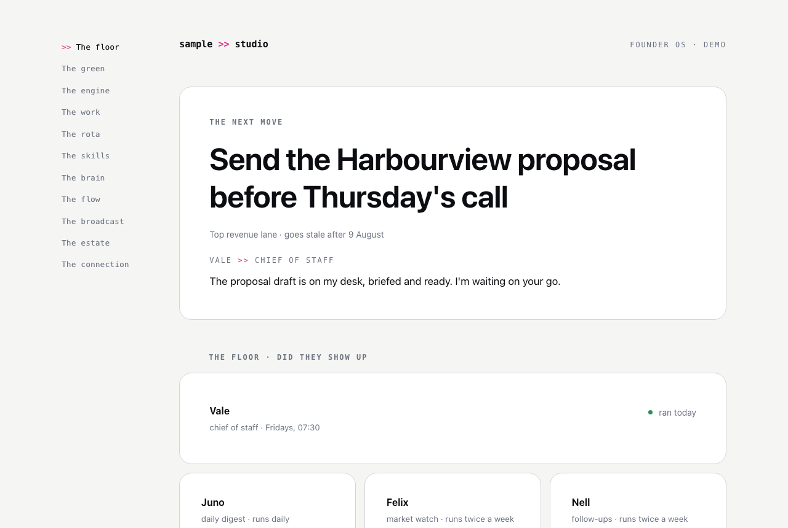
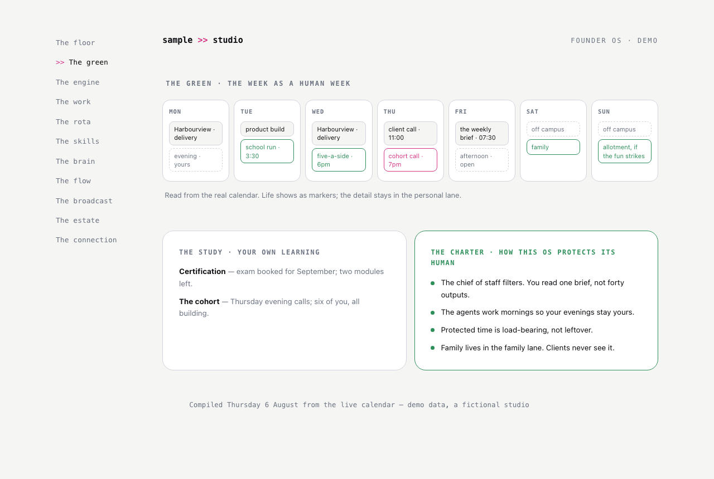
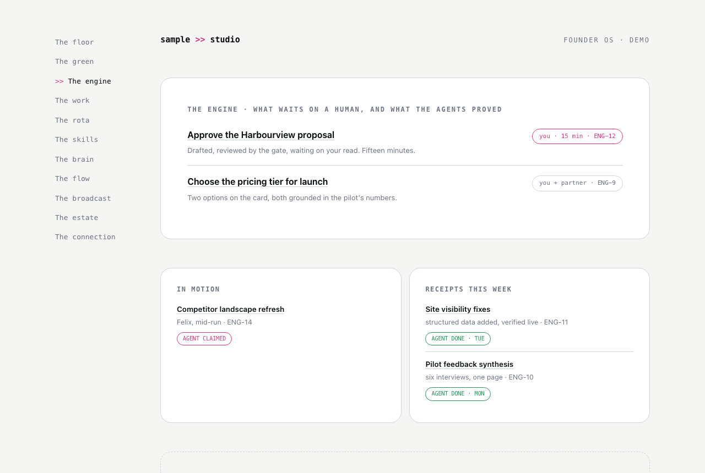

# Founder OS

A calm command centre for a founder who works with more than one AI tool.

If you've ever run a business with people in it, you'll remember what a good office gave you. You could look up and see who was working on what. You could hand a job to someone and trust it would come back done, with a note. You could feel the state of things without asking. And if you're building your first business right now, on your own, with AI tools where the employees would be, that feeling is exactly what's missing: the work happens, but you can't see it, and you've quietly become the person carrying every task between the tools.

Founder OS puts the office back. It's a small set of pages that sits on your own machine and treats your AI setup the way you'd treat a workplace: your tools become buildings on a campus, your agents become colleagues with names and desks, and the day-to-day starts to feel like somewhere you can orientate yourself each morning rather than a stack of chat windows. Eleven rooms, each answering exactly one question, all of it running on data that is allowed to say "I don't know".

This repo is the vanilla version: the pattern, with the builder's private data removed, so you can make your own.

## The campus

The whole thing runs on one analogy, and it's worth having before anything else.

Your AI tools are **buildings on a campus**, each with its own faculty: one is better at reasoning and writing, one at code, one at research. You don't crown a favourite; you use each building for what it teaches best. Tools you own but haven't put to work are empty lots, honestly labelled.

Your agents are **colleagues, not buildings**. A colleague clocks in at a building, but nothing that makes them who they are lives there. Name them like people: "Nell hasn't run since Monday" lands differently from "cron job 4 failed", and the difference is what makes you actually look.

A **keycard** is a connection plus a permission, and some doors (send, publish, spend) open only with your signature at the **gatehouse**. Your memory is the **library** and your procedures are the **workshop**: two pillars every building connects to, so nothing stays trapped where it was made.

And at the centre of the campus is the **green**: the open space where you're not in any building at all — family, sport, learning, rest. It's on the map because a founder OS that can't see your Wednesday evening will schedule over it forever.

## What it looks like

Three of the rooms, with demo data for a fictional studio. The pages themselves are in [demo/](demo/) — download the repo and open them in any browser, nothing to install.

**The floor** — did my agents show up today? The next move at the top, one line from the chief of staff, and every agent at a named desk with an honest last-ran read.

**The green** — the week as a human week. Work blocks, life markers, protected time drawn as first-class blocks, and the charter: the rules the system obeys about its human.

**The engine** — what waits on a human, what's in motion, and receipts for what the agents proved. It points at the real task board; it never duplicates it.

## The rooms at a glance

| Room | The one question it answers |
|---|---|
| [The floor](rooms/01-the-floor.md) | Did my agents show up today? |
| [The green](rooms/02-the-green.md) | What does my week look like as a human, not a machine? |
| [The engine](rooms/03-the-engine.md) | What work is moving, and what waits on me? |
| [The work](rooms/04-the-work.md) | Where do I sit down and do the job? |
| [The rota](rooms/05-the-rota.md) | When does everything run, and on whose meter? |
| [The skills](rooms/06-the-skills.md) | How is work done here, and is it owned or rented? |
| [The brain](rooms/07-the-brain.md) | What does my system remember, and is it healthy? |
| [The flow](rooms/08-the-flow.md) | How does data move through my whole stack? |
| [The broadcast](rooms/09-the-broadcast.md) | What am I saying to the world, and on which frequency? |
| [The estate](rooms/10-the-estate.md) | Are my public websites in good order, for people and for agents? |
| [The connection](rooms/11-the-connection.md) | What does all of this mean, and what's worth writing about? |

Read them in that order and you'll walk my daily loop first (floor, green, engine, work), then the reference rooms, then the outward-facing ones. The connection comes last on purpose: it's the room that joins the dots.

## The rules underneath

Every room obeys the same [honesty rules](principles/honesty-rules.md), and they're the actual product. The short version: never fabricate a signal, label every placeholder, one timestamp one truth, silence beats filler, and busyness is not progress. My first version of this dashboard died because it broke those rules. This one has held because it can't.

## Where it came from

Built in the open in Cornwall, mostly by talking to an agent over a couple of days, standing on the shoulders of people who shared their working generously. The concepts this borrows and what was changed are credited properly in [principles/credits.md](principles/credits.md): Nate B. Jones's Open Brain, Open Skills, and Open Engine; Ankit Patel's architecture thinking; and the Exec Circle community around them. The campus metaphor, the honesty rules, and the green are the parts I'd claim as mine.

If you build your own version, I'd genuinely like to see it. wendy@fourteenseed.com

Wendy Harris, Fourteen Seed
Cornwall >> internet
