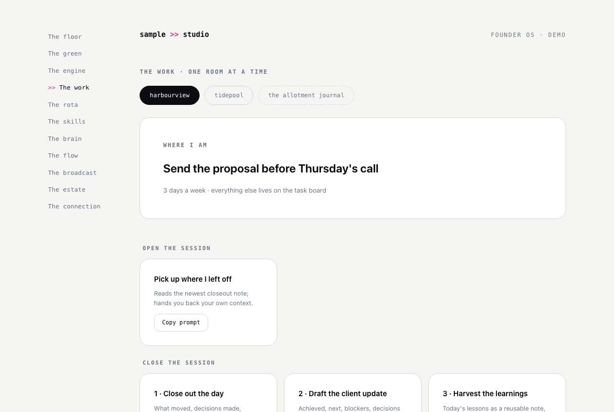

# The work

**The question it answers:** Where do I sit down and do the job?

*One room, many contexts: the project pills swap the context, the bench of copy-button prompts never changes.*

**The analogy.** One room, many contexts. The tools on the bench never change; switching projects swaps only the context — like a workshop where the bench stays put and the job on it changes.

**What's on the page.** Project switcher at the top (in honest priority order: what earns, what might, what's for love). Per project: where I am (the one open thing, from live data), and the bench — copy-button prompts for the session arc: pick up where I left off, unblock me, close out the day, draft the update, harvest the learnings. Every prompt readable before copying; time-bound prompts carry a visible review-by tag.

**The rule it carries.** Prompts are content, and content goes stale. Also: the prompts invoke procedures that live in one canonical place (the skills), so the bench holds buttons, never copies.

**Inspired by / changed.** The bench pattern is original; the closeout discipline borrows from session-closeout practices shared in Nate's community. The personal project gets a deliberately gentler bench — no client updates, no deadlines.

**Building yours.** Start with three prompts: morning pickup, evening closeout, update draft. The closeout is the sleeper hit — it creates the very activity data the rest of the OS wishes existed.
