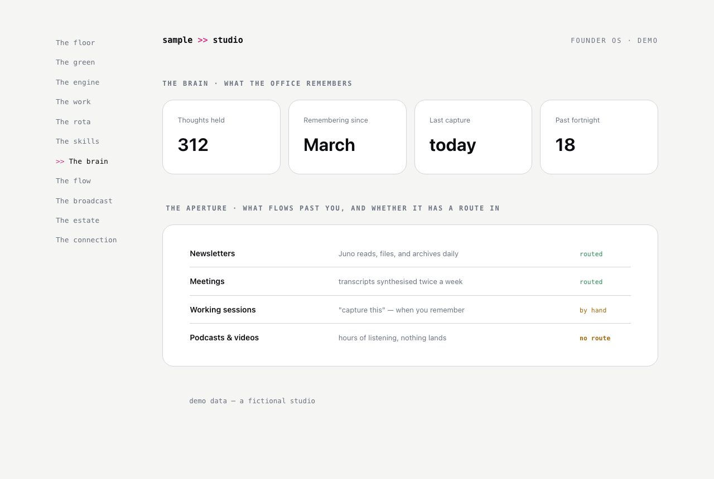

# The brain

**The question it answers:** What does my system remember, and is it healthy?

*The pulse of the memory store, and the aperture: every input medium with its capture route marked routed, by hand, or honestly no route.*

**The analogy.** The library: and its health inspection. Every campus has one; almost nobody checks whether the catalogue is rotting.

**What's on the page.** The pulse: how many memories, since when, last capture, recent rhythm. The themes it holds. Who feeds it (agents provide bulk; the human's rare entries are the valuable ones). The aperture: every input medium: newsletters, meetings, email, working sessions, listening; with its capture route marked routed, by hand, paused, or no route. Trend and drift. Health flags (split tags, unused types). And a resonance strip: what the memory predicted about your life.

**The rule it carries.** Never fabricate; the aperture marks "no route" honestly rather than pretending coverage.

**Inspired by / changed.** The memory store itself follows Nate B. Jones's Open Brain (portable memory, outside any one tool). The health inspection, the aperture, and the who-feeds-it split are the additions; the original's first inspection found its intake had silently narrowed for a fortnight because one route paused.

**Building yours.** Needs an actual memory store first; skip this room until one exists. The aperture is the highest-value section: make every route deliberate and visible, so narrowing is a choice, never an accident.
