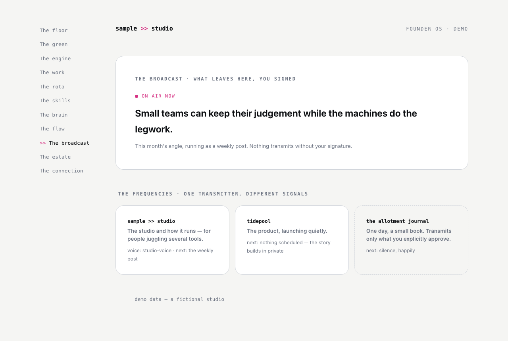

# The broadcast

**The question it answers:** What am I saying to the world, and on which frequency?

*The current angle on air, and the frequencies: one per project, each with its own voice, the personal one happily silent.*

**The analogy.** The transmitter room. One transmitter, several frequencies — one per brand or project, each with its own voice. Nothing goes on air without the human's signature.

**What's on the page.** On air now: the current angle and campaign. Waiting on you: the review queue. The desk: prompts that actually transmit — draft today's post (to a scheduling tool as a draft, never scheduled), review and put it on air (the signature door), log the transmission. The frequencies, each with what the world hears and its voice. The channels with their jobs and honest wire-states. The transmission log, including honest silence.

**The rule it carries.** The human signs everything outward. And a written voice skill guards against sounding like a delegated AI — the acceptance test: would someone who knows you clock it?

**Inspired by / changed.** The frequencies framing is original (the builder's father was a radio operator; it shows). The voice-skill discipline — a blocklist of AI tells, a required only-you-know detail in every piece — grew from a real reader saying she could spot AI-written email instantly.

**Building yours.** Start with the desk's three prompts and one frequency. The voice skill matters more than the page: build it from writing you actually kept, not from anyone's list of nice phrases.
