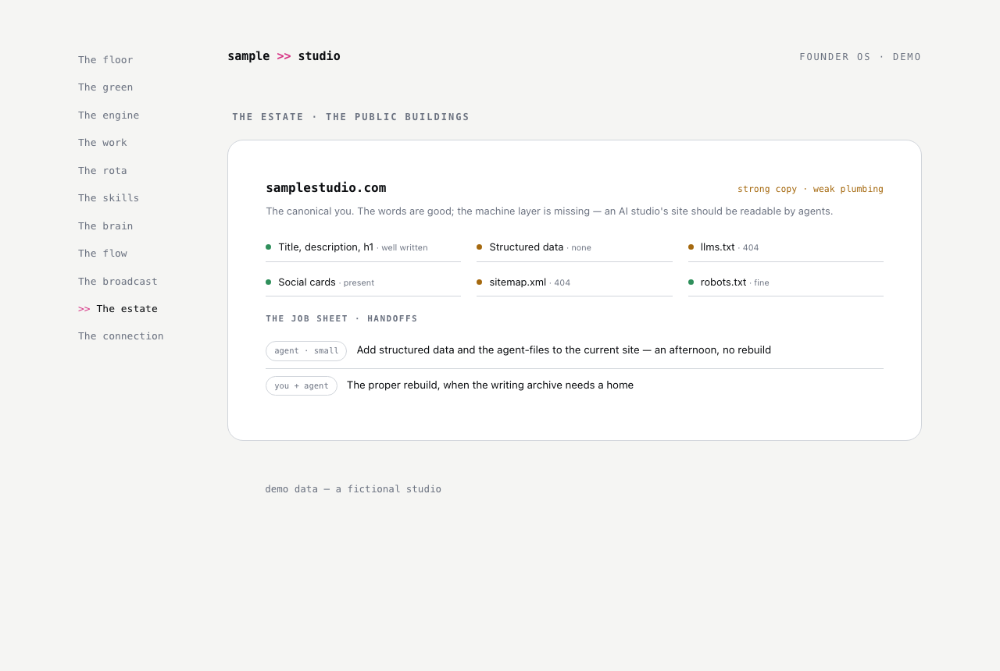

# The estate

**The question it answers:** Are my public websites in good order, for people and for agents?

*One public property audited for real: six checks with honest flags, and a job sheet where every finding becomes a handoff.*

**The analogy.** The public buildings on the estate: the premises the world walks into. Someone should check the roofs.

**What's on the page.** One panel per property: an honest audit (title and description, structured data, social cards, robots.txt, sitemap, llms.txt — each a green dot or a flag with the finding), a verdict, and a job sheet where every finding becomes a handoff with an owner and a link to the real task. Plus the standing move: audit your own estate with your own tools, and publish the before-and-after.

**The rule it carries.** Audit for real before building the page — fetched checks, not assumptions — and re-audit before flipping any flag to green.

**Inspired by / changed.** Original room, with a finding worth sharing: the original's own studio site — an AI consultancy's site — was the least agent-readable property it owned. Fixed the same afternoon, and the before-and-after became content.

**Building yours.** Your agent can run the basic audit in minutes: fetch each site, check the six basics, mind the false-200s from SPA catch-alls. The job sheet makes it actionable instead of a report.
