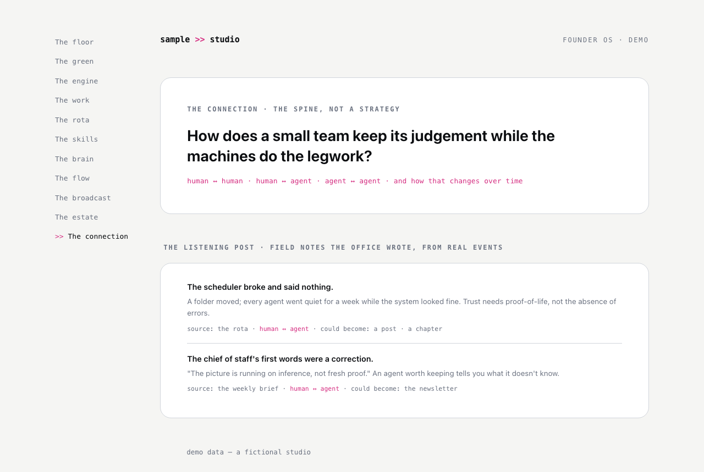

# The connection

**The question it answers:** What does all of this mean, and what's worth writing about?

*The spine question at the top, and the listening post: field notes the office wrote about itself, just by running.*

**The analogy.** Deliberately the last room: the one that joins the dots. Part observatory, part editor's desk.

**What's on the page.** The spine: your through-line, the question underneath all your work, stated once and permanently. The lanes of that question, each with a current belief and an open question. The listening post: field notes harvested from the OS itself; the stories your own system generates just by running (a silent scheduler failure is a trust story; an agent's first honest report is a delegation story). A dated ledger of how your own working practice is changing. And the pipeline out: field note, then the spine test (is it on-theme, could only you say it, has it passed the gate), then a channel.

**The rule it carries.** Silence beats filler; a field note is only captured when something genuinely revealed itself.

**Inspired by / changed.** Original, and the youngest room of the original build: expected to evolve. Its founding insight: if you build an office of humans and agents, you are living inside the best primary source you'll ever have on how humans and agents work together.

**Building yours.** Start with a spine sentence and a hand-captured field note when something real happens; notes are dated markdown files in one folder, and the best ones become the posts, newsletter editions, and talks the broadcast sends out. An automated listener can come later, after your hand knows what a good note is. An automated listener can come later, after your hand knows what a good note is.
