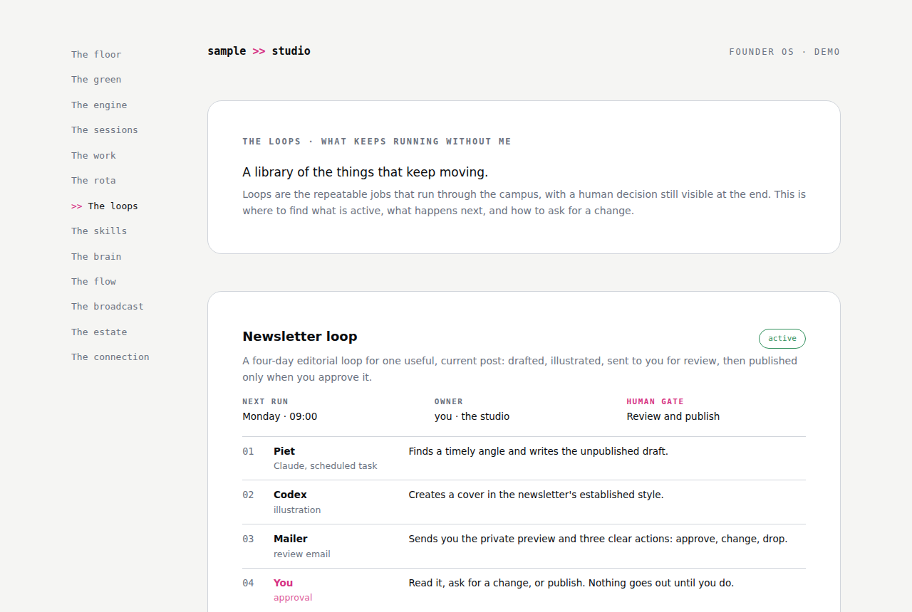

# The loops

**The question it answers:** What keeps running without me, and where is my hand on it?

*A register of the repeatable jobs: each loop's steps in order, who or what does each one, when it next runs, and the human gate at the end.*

**The analogy.** The standing orders pinned up in the staff room. Not the timetable (that's the rota) and not the receipts (those are on the board in the engine room), but the plain description of each job that runs on its own: what happens, in what order, and where the signature goes.

**What's on the page.** One block per loop. A name, a paragraph saying what it produces, a status (active, building, paused), the next run, the owner, and the human gate, written out. Then the steps, numbered, each with who does it (a named colleague, a tool, or you) and one line on what they do. The last step is always a human, and it's drawn in the accent colour so the eye finds it. At the bottom, how to change a loop: say its name. A page like this is what lets you hand "update the newsletter loop" to an agent and have it know what you mean.

**The rule it carries.** Point, don't duplicate, and the gate is the last step. This room is a register for humans; the schedule lives in the rota and the runs leave receipts on the board. A loop with no human gate is not a loop, it's an agent publishing on its own, and that is a signature door.

**Inspired by / changed.** The receipts vocabulary each loop leaves behind is Nate B. Jones's Open Engine. The register itself came from running three editorial loops at once and losing track of which one did what. Nothing clever changed: it's a page written by hand that says it's a snapshot.

**Building yours.** Write your first loop down in prose before you automate any of it: the steps, who does each, and where you sign. If you can't write the gate, don't build the loop. Then build it one step at a time, and update the register as each step comes alive, marking it building until the whole thing has run end to end at least once. Plain HTML is enough; this page in the original is a manual snapshot and says so in its footer, which is exactly what the honesty rules ask of it.
